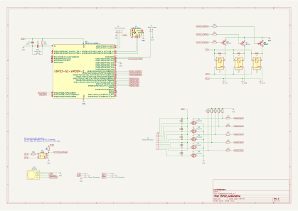
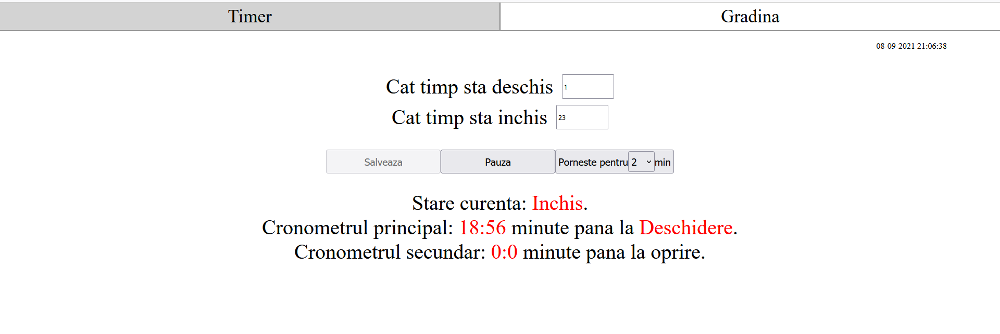
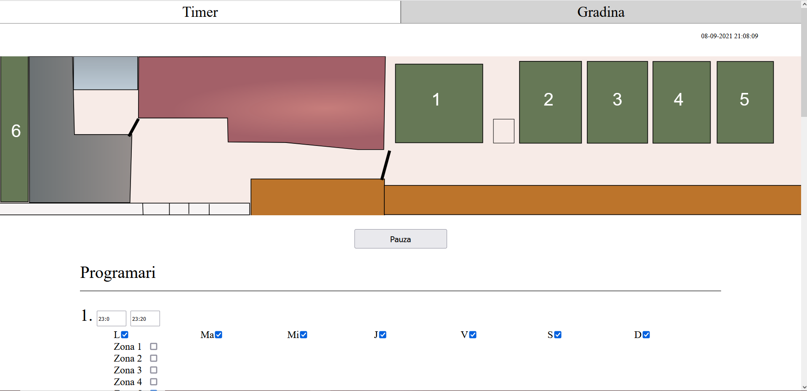

# AutoGarden
Codul si schema unui circuit pentru automatizarea gradinii. 
Circuitul este potrivit daca:
 - Ai o pompa de apa ce alimenteaza un bazin separat (pompa pornita fie dintr-un contactor fie cu ajutorul unui presostat cu o electrovalva de 220V)
 - Doresti din timp in timp sa uzi gradina pe zone folosind electrovalve de 12V
 - Doresti o interfata web pentru a controla tot sistemul si pentru a programa pe ore si zile udarea gradinii
 - Doresti un proiect autonom in lipsa internetului

Desigur pot fi contruite doar sectiuni din proiect care sa excluda, de exemplu, contactorul.

# Componente electrice
 - O sursa de alimentare ce poate furniza 12V cu 3A, 5V cu 1A
 - ESP32 NodeMCU
 - Breadboard
 - 8 diode
 - 5 mosfeturi IRLZ44N.  ( **Atentie!** Acesta e un mosfet de nivel TTL adica de 5V. Nu-l incurcati cu IRFZ44N )
 - 8 rezistente de 10k
 - 5 rezistente de 100ohm
 - 3 relee
 - Ceas RTC modul DS3231 ( **obligatoriu** )
 - 1 contactor
 - 5 electrovalve 12V 5W
 
 
# Alimentare
Alimentare de joasa tensiune se face printr-un conector de 3 pini: 12V, 5V si GND(minus).
Alimentare de 220V se face la locurile marcate in schema ca `SURSA_AC_NUL` si `SURSA_AC_FAZA`

# Caracteristici
 - Controlul de la distanta a intregului sistem
 - 50 de posibile programari ale electrovalvelor cu variabile: zile de activitate, intervalul de functionare si electrovalva/releul ce va fi activat.
 - 5 porturi pentru electrovalve la 12V
 - 3 porturi la 220V cu proprietatile (activate de relee):
   - 1 port de mica putere pentru deschiderea unei electrovalve la 220V ( la care este conectata pompa de apa )
   - 1 port conectat la un contactor ce permite deschiderea directa a pompei sau a altor aparate de putere
   - 1 port de mica putere pentru orice alta necesitate
 - Posibilitatea in cod si in schema electronica de a mai adauga porturi de 12V sau relee.
 - Timp sincronizat pe internet. In cazul lipsei de conectiune la internet ceasul intern este folosit
 - Reprogramare sigura de la distanta cu parola ( Nu este nevoie sa reprogramati microprocesorul prin usb )
 - O serie de comenzi pentru "depanarea" de la distanta. Optiunile includ:
   - puterea semnalului
   - dimensiunea curenta a heap-ului
   - evenimentul ce a determinat deschiderea microprocesorului (POWER_ON, RESET, WATCHDOG, etc)
   - etc.  
 - Auto-resetarea in cazul in care se blocheaza microprocesorul
 - Salvarea tuturor setarilor in memorie non-volatila
 - Auto-reconectarea la reteaua WIFI

# Instalare software
Sunt necesari cativa pasi pentru a putea folosi codul:
 - in `ESP32_AutoGradina/ESP32_AutoGradina.ino` schimba valorile:
   - `YOUR SSID` cu SSID-ul tau
   - `YOUR PASSWORD` cu parola WIFI-ului
   - `YOUR ARDUINO OTA PASSWORD` cu un cod lung si unic. Aceasta va fi parola ceruta de Arduino pentru a reprograma microprocesorul de la distanta.  
 - schimbarea imaginii gradinii. Vezi sectiunea `Intructiuni`
 - copierea librariilor din folderul `libraries` in folderul `libraries` din Arduino

# Pagini web
Exista 3 ferestre:
 - Fereastra `Timer` cu fisierele corespunzatoare: 
   - `index.html`
   - `script.js`
   - `style.css`
 - Fereastra `Gradina` cu fisierele:
   - `gradina.html`
   - `script_garden.js`
   - `style.css`
 - Fereastra de debug:
   - `debug_page.html`
   - `debug_script.js`
 
De asemenea exista un fisier `garden.svg` ce contine o imagine ( pe post de exemplu ) a pozitiilor tuturor electrovalvelor. Va trebui sa-l modifici.

## Instructiuni
Pentru a modifica fiserele html/stiluri sau javascript:
 - Modificati fisierul corespunzator din folderul `www`
 - Copiati continutul noului fisier in fereastra uneltei `Compress HTML Tool`. Unealta va detecta automat tipul limbajului si il va comprima pentru a fi folosit in Arduino
 - Copiati versiunea comprimata in fisierul `ESP32_AutoGradina/FileData.h` in variabila corespunzatoare.

Pentru a modifica imaginea gradinii:
 - Creati o imagine svg a gradinii
 - Deschideti imaginea intr-un text editor si copiati continutul in fisierul `www/gradina.html` in locul tagului `<svg>`. ( **Atentie!** Pastrati optiunile din acest tag precum `viewBox` si `width` )
 - Modificati in fisierul `www/script_garden.js` lista numita `garden_zones` cu id-urile dreptunghiurilor corespunzatoare zonelor udate. ( Le puteti gasi in fisiserul `svg` pe linii de tipul `<rect id="svg_1" height="323.99998" width="61.00001" y="-2.05" x="1.5" stroke-width="1.5" stroke="#000" fill="#667856"/>`. Copiati doar valoarea lui `id` )

# Schematica

# Interfata web
### Timer

### Gradina

